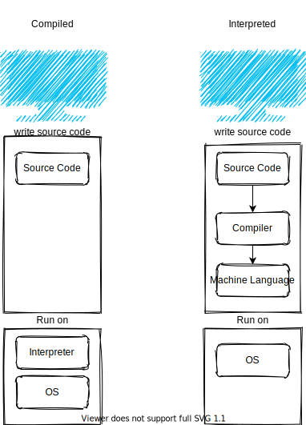

+++
title="JavaScript is interpreted or compiled?"
date=2021-01-14

[taxonomies]
categories = ["JavaScript",]
tags = ["JavaScript","compiled", "interpreted", "JIT"]

[extra]
toc = "true"
+++

When I began learning to program, they told me there are two kinds of programming languages:

- Compiled Languages
- Interpreted Languages

**_but_**, no one told me about the grey area between them which includes just in time (JIT) compilation

### Interpreted Language

An interpreted language is executed line by line from top to down
so, if there is an error in line 21 in the code/script running, the previous 20 lines have already run and, the program crashed at the 21.

### Ahead Of Time (AOT) Compiled Language

A compiled language is parsed then, compiled then, executed
so, if there is an error in line 21 in the code, there is not code ran because the error was caught in the parsing stage (before the execution stage).

### Just In Time (JIT) compilation

##### Why JIT?

JIT compilation combines the advantages of both of ahead of time compilation and interpretation like interpretation flexibility and AOT compilation high performance.

##### How is it working?

A common implementation of JIT is that the source code is compiled to bytecode -bytecode is an intermediate representation- then bytecode is dynamically compiled to machine code, this improves the runtime performance but adds an overhead time for compilation which, is solved by caching thus, allows to cut the future compilation time since only a portion of the code is compiled instead of the whole codebase like ahead of time compilation.

Bytecode is not a machine code for specific computer architecture, so it's portable among many computer architectures.
The JIT compiler reads the bytecode in many parts then, compile those parts to machine code then, cached to be reused in the future without having to compile it again thus, that the program can run faster, the code can be compiled when it's about to be executed that's why it's called 'just in time'.

##### How is it different from interpretation?

**Interpretation**: interpreters interpret bytecode with poor performance and some interpret the source code with lower performance.
**AOT compilation**: statically compiled (native) code is compiled and outputting machine code on the disk before deployment.
**A dynamic compilation environment** is the one where the compiler can be used during execution, much of the work of parsing and optimize the source code happens at the compile-time before deployment. Compilation from bytecode is much faster than compilation from the source, bytecode is compiled to machine code in memory directly and, JIT executes it. That process provides portability and many possible optimizations that can happen to squeeze better performance.

##### V8 JavaScript Engine

JavaScript is described as a JIT-compiled language, not interpreted, not complied, but in the grey area between them. there are many engines for JavaScript to do that but I will talk about the V8 engine from google.

V8 parser parses the JS source code outputting abstract syntax tree, then Ignition (V8 interpreter) generates bytecode from the syntax tree which, then is optimized and turned into machine code using the Turbofan compiler, the machine code is re-optimized when needed during runtime based on monitoring and profiling

